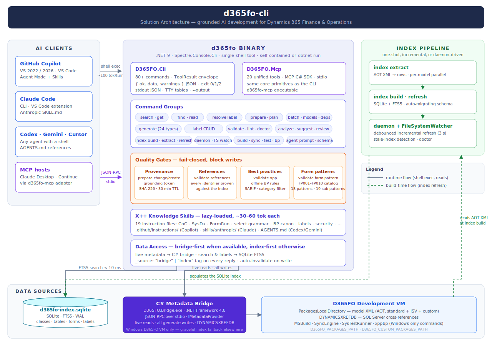
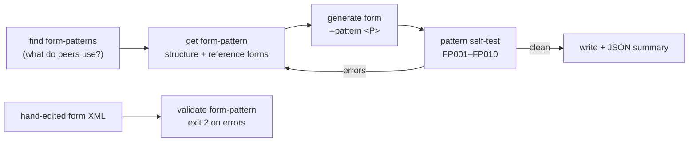

# d365fo — AI-native CLI for D365 F&O X++

<div align="center">

**One binary that knows every X++ class, table, form, and EDT in your D365FO codebase**

[](https://opensource.org/licenses/MIT)
[](https://dotnet.microsoft.com/)
[]()
[]()
[](https://github.com/dynamics365ninja/d365fo-mcp-server)

*Grounded AI development for Dynamics 365 Finance & Operations — works with GitHub Copilot, Claude Code, Codex, Gemini CLI, and any agent with a shell*

</div>

---

## Why

AI assistants excel at C#, Python, and JavaScript. X++ is different: your D365FO codebase is private, deeply customized, and invisible to every model — so AI confidently generates code that doesn't compile.

This CLI pre-indexes your entire D365FO installation (hundreds of thousands of symbols across standard, ISV, and custom models) into a local SQLite index and exposes it as one `d365fo` binary. Every signature, every CoC wrapper, every label, every form pattern — verified against your real metadata **before** the AI writes a single line. And because it is a shell command instead of an MCP tool list, it costs ~100 tokens per turn instead of ~3,500.



| Task | Without `d365fo` | With `d365fo` |
|------|------------------|---------------|
| Method signatures | Guessed → compile errors | `d365fo get class` — exact, from your codebase |
| Existing CoC wrappers | Manual AOT search | `d365fo find coc Class::method` in < 50 ms |
| New forms | Hand-written XML, broken patterns | Pattern-validated scaffolds; structural violations **block the write** |
| Labels | Hardcoded strings | Right `@SYS`/`@MODULE` key found instantly |
| Security chains | Hours of manual tracing | Role → Duty → Privilege → Entry Point in one call |
| Generated code | Hallucinated fields and types | Every reference proven against the index, gated before write |
| Agent context cost | ~70 MCP tool schemas every turn | 1 shell tool + lazy-loaded Skills (~90 % fewer tokens) |

---

## Capabilities

| Feature | Description |
|---|---|
| 🔍 **Full-codebase intelligence** | Tables, classes, EDTs, enums, forms, queries, views, entities, reports, services, workflows, security artifacts, labels (FTS5) — results in milliseconds, no VM round-trip |
| 🛡️ **Grounded generation** | Fail-closed gates: `prepare change`/`prepare create` issue grounding tokens, `validate references` proves every identifier, `validate xpp` enforces BP rules — hallucinated code never reaches disk |
| 🧩 **Form pattern engine** | Catalog of Microsoft form patterns and container sub-patterns: `get form-pattern` serves the required structure, `generate form` self-tests against it (FP001–FP010), `validate form-pattern` re-checks any hand edit |
| ✍️ **Pattern-correct scaffolding** | 24 `generate` commands — tables, classes, CoC, forms (9 patterns), entities, security, SysOperation, workflows, business events, number sequences, XDS policies |
| 🏗️ **SDLC integration** | MSBuild compilation with structured `xppcDiagnostics`, DB sync, xppbp best practices, SysTestRunner — on Windows D365FO VMs |
| 📐 **X++ knowledge base** | 19 lazy-loaded Skills: select grammar, CoC authoring, FormRun lifecycle, BP rule canon — loaded only when relevant, for Copilot and Claude alike |
| ⚡ **Agent-first ergonomics** | Stable `{ ok, data, warnings }` JSON envelope, `search batch` / `get batch` / `prepare` single-round aggregators, `agent-prompt` + `schema` manifests |
| 🔌 **Daemon & MCP adapter** | Warm-cache named-pipe daemon with file-system watcher; `d365fo-mcp` speaks JSON-RPC 2.0 over the same index for MCP-only hosts |

### Pattern-grounded form development

Forms are the hardest artifact to generate correctly — each pattern dictates required containers, ordering, and allowed sub-patterns. The form pattern engine makes it a guided pipeline:



Structural violations (wrong order, missing container, disallowed control, misapplied sub-pattern) **block the write** while `D365FO_FORM_PATTERN_ENFORCE=true` (the default) — recommendations only warn.

---

## Quick Start

### Prerequisites

- [.NET SDK 10](https://dotnet.microsoft.com/download) (pinned in `global.json`)
- Access to a D365 F&O `PackagesLocalDirectory` (local clone, Azure Files share, or Windows VM path)

### Install

```sh
git clone https://github.com/dynamics365ninja/d365fo-cli.git
cd d365fo-cli
dotnet build d365fo-cli.slnx -c Release
```

**PowerShell alias (fastest for dev):**

```powershell
function d365fo { dotnet run --project C:\path\to\d365fo-cli\src\D365FO.Cli -- @args }
```

**Self-contained binary (for distribution):**

```sh
dotnet publish src/D365FO.Cli -c Release -r win-x64 --self-contained
# also: linux-x64, osx-arm64
```

### First run

```sh
# Point at your packages folder
$env:D365FO_PACKAGES_PATH = "K:\AosService\PackagesLocalDirectory"

# Build + populate the index
d365fo index build
d365fo index extract

# Verify
d365fo doctor --output json
d365fo index status --output json

# Search
d365fo search table Cust --output json
d365fo get table CustTable --output json
d365fo get batch table:CustTable class:CustTableType edt:CustAccount --output json
d365fo find coc SalesTable::insert --output json
d365fo resolve label @SYS12345 --lang en-us,cs
```

### Scaffold your first object

```sh
# New table
d365fo generate table FmVehicle \
  --label "@Fleet:Vehicle" \
  --field VIN:VinEdt:mandatory \
  --field Make:Name \
  --field Year:YearEdt \
  --out src/MyModel/AxTable/FmVehicle.xml

# Chain-of-Command extension
d365fo generate coc SalesTable --method insert --out src/MyModel/AxClass/SalesTable_MyExt.xml

# Form — consult the pattern spec, scaffold, and the write is pattern-gated
d365fo get form-pattern SimpleList --output json
d365fo generate form FmVehicles \
  --pattern SimpleList \
  --table FmVehicle \
  --field VIN --field Make --field Year \
  --out src/MyModel/AxForm/FmVehicles.xml
```

Full walkthrough: **[docs/SETUP.md](docs/SETUP.md)**

---

## AI Agent Integration

### GitHub Copilot (VS Code / Visual Studio)

Copy `.github/copilot-instructions.md` into your consuming repo's `.github/` folder. It contains the full X++ rule canon with MS Learn citations.

```sh
python3 scripts/emit-skills.py                                   # emit instruction files
cp skills/copilot/*.instructions.md /your-repo/.github/instructions/
```

### Claude Code / Claude Desktop

```sh
python3 scripts/emit-skills.py                                   # emit Anthropic SKILL.md files
cp -r skills/anthropic/ /your-repo/.claude/skills/
```

### Codex CLI / Gemini CLI / Cursor

Reference the `SKILL.md` files from `skills/anthropic/` in your session prompt or `AGENTS.md`.

### MCP (Claude Desktop, Continue, VS Code MCP)

The bundled `d365fo-mcp` adapter speaks JSON-RPC 2.0 over the same index — including `batch_get_info`, `get_form_pattern_spec`, and `validate_form_pattern`:

```json
{
  "mcpServers": {
    "d365fo": {
      "command": "d365fo-mcp",
      "args": [],
      "env": { "D365FO_PACKAGES_PATH": "K:\\AosService\\PackagesLocalDirectory" }
    }
  }
}
```

### Verify

Open the AI chat and ask:

```
What tables contain "CustAccount" field?
```

A `d365fo search` shell call returning results from your codebase = you're connected.

---

## Why CLI instead of MCP?

MCP servers inject every tool definition into the model's context on every single turn — for this project's sibling MCP server that is ~61 tools ≈ 3,500 tokens per turn.

| | MCP server | CLI + Skills |
|---|---|---|
| Tool definitions per turn | ~61 tools (~3,500 tokens) | 1 shell tool (~100 tokens) |
| Discovery round-trips | 2–3 per task | often 1 (`d365fo prepare change`) |
| Scriptable (shell, CI/CD) | No | Yes |
| Works in any AI harness | No — MCP hosts only | Yes — Copilot, Claude, Codex, Gemini, … |
| Token cost over 15-turn workflow | baseline | **~90 % reduction** |

See [docs/TOKEN_ECONOMICS.md](docs/TOKEN_ECONOMICS.md) for the full analysis and the cases where MCP still wins. Migrating from `d365fo-mcp-server`? Start with **[docs/MIGRATION_FROM_MCP.md](docs/MIGRATION_FROM_MCP.md)**.

---

## Commands at a Glance

| Group | Commands |
|---|---|
| **Prepare** | `prepare change`, `prepare create` — single-round context aggregators returning a grounding token |
| **Validate** | `validate name`, `validate xpp` (offline BP rules), `validate references` (anti-hallucination gate), `validate form-pattern` (FP001–FP010 structural validator) |
| **Index** | `index build`, `index extract`, `index refresh`, `index status` (incl. `stale-index` detection), `index export`, `index import`, `index optimize`, `index history` |
| **Discover** | `search any`, `search batch`, `search class\|table\|edt\|enum\|form\|query\|view\|entity\|report\|service\|workflow\|label\|business-event\|security-policy\|configuration-key\|tile\|workspace` |
| **Get** | `get object`, `get batch` (up to 10 objects per call), `get form-pattern` (pattern spec catalog), `get table\|class\|edt\|enum\|form\|menu-item\|security\|label\|role\|duty\|privilege\|query\|view\|entity\|report\|service\|business-event\|security-policy` |
| **Find** | `find related`, `find coc`, `find relations`, `find usages`, `find extensions`, `find handlers`, `find refs`, `find form-patterns`, `find batch-jobs` |
| **Read** | `read class`, `read table`, `read form` |
| **Resolve** | `resolve label` |
| **Generate** | `generate table\|class\|coc\|form\|entity\|extension\|event-handler\|privilege\|duty\|role\|report\|sysoperation\|number-sequence\|workflow\|menu-item\|edt\|enum\|query\|business-event\|custom-service\|migration-script\|runbase\|security-policy` |
| **Labels** | `label create\|rename\|delete` — in-place `*.label.txt` edits, multi-language via `--lang` |
| **Analyze** | `analyze completeness`, `analyze integration`, `analyze impact`, `lint`, `suggest edt`, `suggest extension`, `report-integrations` |
| **Review** | `review diff` |
| **Models** | `models list`, `models deps`, `models coupling` |
| **Agent** | `agent-prompt`, `schema` |
| **Daemon** | `daemon start\|status\|stop\|warmup` |
| **Ops (Windows VM)** | `build`, `sync`, `test run`, `bp check` |

One worked example per command: **[docs/EXAMPLES.md](docs/EXAMPLES.md)**

### When to use built-in editor tools vs. `d365fo`

**One-line rule:** if the file ends in `.xml` and is an AOT object → always `d365fo`. Everything else (config, scripts, docs) → standard editor tools.

> ⛔ **When `d365fo` returns `ok: false`** — report the error to the user and stop. Metadata read from open XML files does **not** substitute for the CLI. Never fall back to PowerShell / Python scripts to write AOT XML.

The full scenario-by-scenario decision table lives in **[docs/CAPABILITIES.md](docs/CAPABILITIES.md)**.

---

## Documentation

| Getting started | Reference | Operations |
|-----------------|-----------|------------|
| [Setup](docs/SETUP.md) — install, configure, verify | [Examples](docs/EXAMPLES.md) — one per command | [Troubleshooting](docs/TROUBLESHOOTING.md) |
| [Migration from MCP](docs/MIGRATION_FROM_MCP.md) | [Architecture](docs/ARCHITECTURE.md) — index schema, AOT coverage, lint rules, daemon | [Token economics](docs/TOKEN_ECONOMICS.md) |
| [Capabilities](docs/CAPABILITIES.md) — tool decision table | [Configuration](docs/CONFIGURATION.md) — env vars and profiles | |

---

## Troubleshooting

| Symptom | Fix |
|---|---|
| `PACKAGES_PATH_NOT_FOUND` | Set `D365FO_PACKAGES_PATH` or pass `--packages <PATH>` |
| `UNSUPPORTED_PLATFORM` | `build` / `sync` / `test` / `bp` require Windows + a D365FO dev VM |
| `NO_INDEX` | Run `d365fo index build` then `d365fo index extract` |
| `FORM_PATTERN_VIOLATION` | The generated/edited form breaks its pattern — `d365fo get form-pattern <P>` shows the required structure |
| Index appears stale after editing XML | Run `d365fo index refresh --model <Model>` |
| Index file locked | Stop any running `d365fo daemon` or `d365fo-mcp` process; WAL sidecar files (`-wal`, `-shm`) are normal |

More in [docs/TROUBLESHOOTING.md](docs/TROUBLESHOOTING.md) and [docs/SETUP.md](docs/SETUP.md#troubleshooting).

---

## License

MIT. The sibling [`d365fo-mcp-server`](https://github.com/dynamics365ninja/d365fo-mcp-server) is also MIT.

## Disclaimer

This project is an independent research effort and is not affiliated with, endorsed by, or associated with Microsoft or any other organization. It is provided as-is for educational and development purposes.
