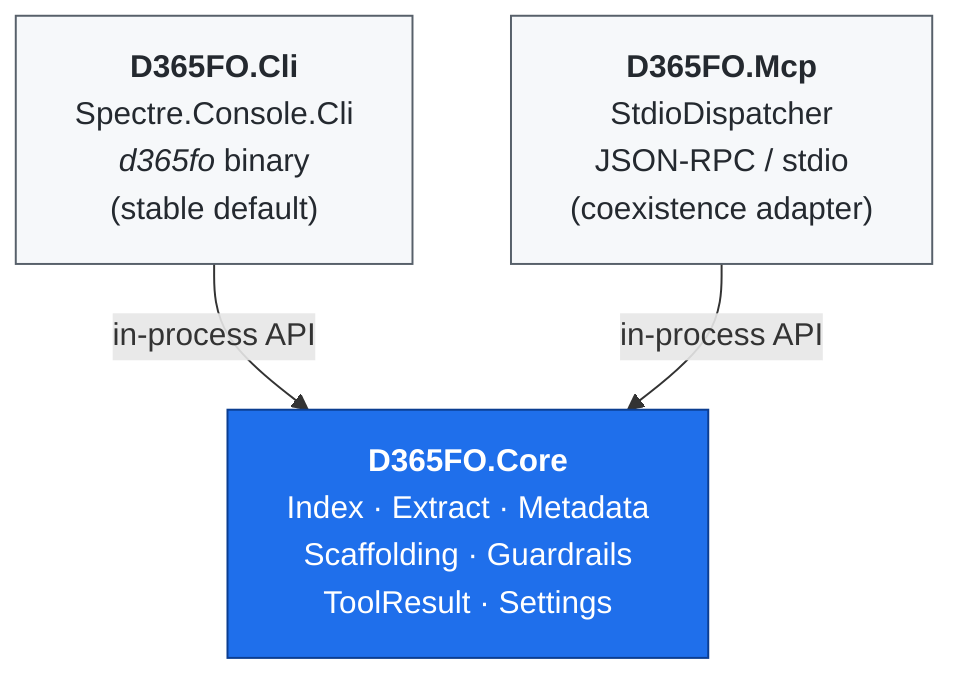

# Architecture

> **Audience:** contributors, integrators, anyone curious about what happens under the hood.
> **If you just want to use the tool, read [SETUP.md](SETUP.md) and [EXAMPLES.md](EXAMPLES.md) instead.**

This document explains how `d365fo-cli` is put together: the three projects that make up the solution, the shared data contracts, the local index, and the optional Metadata Bridge used for live D365FO operations.

## Contents

1. [High-level layout](#high-level-layout)
2. [Output contract (`ToolResult<T>`)](#output-contract-toolresultt)
3. [The local index (SQLite)](#the-local-index-sqlite)
4. [Extraction pipeline](#extraction-pipeline)
5. [Guardrails](#guardrails)
6. [Metadata Bridge (live D365FO reads and writes)](#metadata-bridge-live-d365fo-reads-and-writes)
7. [MCP coexistence](#mcp-coexistence)
8. [Why .NET 10](#why-net-10)

---

## High-level layout

Three projects, one shared core:



**Key invariant:** only `D365FO.Core` knows about D365FO. Both CLI and MCP are thin adapters — each command handler is essentially "parse args → call Core → render envelope".

## Output contract (`ToolResult<T>`)

Every tool returns the same shape:

```json
{ "ok": true,  "data": { /* ... */ }, "warnings": ["..."] }
{ "ok": false, "error": { "code": "UPPER_SNAKE", "message": "...", "hint": "..." } }
```

- JSON is the default on non-TTY stdout.
- Interactive terminals render Spectre tables.
- Override with `--output json|table|raw`.

## The local index (SQLite)

- Single file at `$D365FO_INDEX_DB` (default: `$LOCALAPPDATA/d365fo-cli/d365fo-index.sqlite`).
- Schema **v10**, defined in [`src/D365FO.Core/Index/Schema.sql`](../src/D365FO.Core/Index/Schema.sql). v6 added a `LabelFts` FTS5 virtual table; v7 adds `Models.LastExtractedUtc` + `Models.SourceFingerprint` (per-model content fingerprint) and an append-only `ExtractionRuns` telemetry table; v8 adds `Forms.Pattern`, `Forms.PatternVersion`, `Forms.Style`, `Forms.TitleDataSource` and `FormDataSources.OrderIndex`/`JoinSource`; v9 adds `HasDocComment`, `HasTodayCall`, `HasDoInsertOrUpdate` boolean flags to both `Methods` (class) and `TableMethods` — populated at extract time by scanning `<Source>` CDATA, used by the `today-usage`, `do-insert-update`, and `doc-comment-missing` lint categories; v10 extends the schema further (see changelog).
- Version tracked in `PRAGMA user_version`; migrations applied automatically on first connection via `MetadataRepository.EnsureSchema`.
- `MetadataRepository` is stateless — every call opens and closes its own connection, so it works identically in a short-lived CLI process, a long-lived MCP server, or a daemon.
- SQLite booleans are stored as `INTEGER`; `SqliteBoolHandler` teaches Dapper the conversion once at static init.

### AOT types covered

Tables (fields, relations, indexes, methods, delete actions), Classes (methods + attributes), EDTs, Enums, Forms (+ extensions), MenuItems, Labels (multi-language), Queries (+ datasources), Views (+ fields), DataEntities (+ fields + OData names), Reports (+ datasets), Services (+ operations), ServiceGroups (+ members), WorkflowTypes, SecurityRoles / Duties / Privileges plus a flattened `SecurityMap`, ObjectExtensions, EventSubscribers, CoC extensions, and ModelDependencies parsed from each package's `Descriptor/*.xml`.

## Extraction pipeline

`MetadataExtractor.ExtractAll(packagesRoot)` walks `<root>/<Package>/<Model>/` and yields one `ExtractBatch` per model.

- Per-file XML parsing inside a model runs in `Parallel.ForEach` (degree = `Environment.ProcessorCount`).
- Label resources are scanned recursively under `AxLabelFile/LabelResources/<lang>/` (modern D365 layout; the legacy inline `<AxLabel>` manifest is also supported).
- `*FormAdaptor` companion packages are skipped at both package and model level (`MetadataExtractor.IsFormAdaptorPackage`) — they hold no real AOT content.
- `D365FO.Core.Extract.XppSourceReader` extracts the `<SourceCode><Declaration>` block and per-method `<Source>` CDATA from AOT XML for `d365fo read class|table|form`.

## Guardrails

- **`StringSanitizer`** strips control characters from free-form metadata (labels, descriptions) to defend against prompt-injection embedded in customer data. Opt out with `--raw-text`.
- Error envelopes are always structured — raw exception text never reaches stdout.
- Write operations that mutate XML use atomic swap + `.bak` (see `generate` and `Scaffolding/ScaffoldFileWriter`).

## Metadata Bridge (live D365FO reads and writes)

When running on a Windows D365FO developer VM, `D365FO.Core` can route reads and writes through a **`D365FO.Bridge` sibling project** — a .NET Framework 4.8 child process started over stdio JSON-RPC. The bridge loads D365FO's own assemblies at runtime and exposes `IMetadataProvider` + `DiskProvider` operations, so the CLI always speaks to the same store Visual Studio and MSBuild use.

### Bootstrap

`MetadataBootstrap` late-binds `Microsoft.Dynamics.AX.Metadata.Storage.MetadataProviderFactory.CreateRuntimeProviderWithExtensions` and resolves `Microsoft.Dynamics.AX.*` assemblies through an `AppDomain.AssemblyResolve` hook against `D365FO_BIN_PATH` (defaults to `D365FO_PACKAGES_PATH\bin`). The provider instance is cached and lock-guarded; a failed bootstrap surfaces `LastError` so the CLI can fall back to the index.

### JSON-RPC surface

One request per line, UTF-8:

| Method | Purpose |
|---|---|
| `ping` | Liveness + diagnostics (`binPath`, `packagesPath`, `metadataLoaded`, `metadataError`). |
| `shutdown` | Graceful exit. |
| `readClass` / `readTable` / `readEdt` / `readEnum` / `readForm` | Authoritative per-object read. `readEnum` falls back to CLR kernel enums (`NoYes`, `Exists`) via `Microsoft.Dynamics.AX.Xpp.Support.dll` when the disk overlay has no match; the response carries `source: "bridge-kernel"`. |
| `createObject` / `updateObject` / `deleteObject` | Routed through the provider collections' `Create`/`Update`/`Delete` with a `ModelSaveInfo` built from the target model manifest. Create/Update accept an optional raw Ax* XML blob round-tripped via `XmlSerializer`. |
| `findReferences` | Parameterised query against `DYNAMICSXREFDB` (`Names` + `[References]` + `Modules`); returns source path, line, column, reference kind. Connection string overridable via `D365FO_XREF_CONNECTIONSTRING`. |
| `getModelFolder` | Resolves `ModelManifest.GetFolderForModel` to the on-disk package folder — used by `generate --install-to` to compose `<ModelFolder>/Ax<Kind>/<Name>.xml`. |

### Serialisation

`AxSerializer` is a reflection-based walker with a depth cap of 6, reference-cycle-guarded via `HashSet<object>` + `ReferenceEqualityComparer`. It drops empty arrays and handles primitives, enums, `DateTime`, and `decimal` specifically. Good enough for Copilot-sized prompts; hand-rolled serialisers can be layered on per kind later.

### CLI integration

- `D365FO.Core.Bridge.BridgeClient` spawns the net48 exe and pumps JSON-RPC.
- `BridgeGate` in `D365FO.Cli` gates every call behind `D365FO_BRIDGE_ENABLED=1`.
- `d365fo get class|table|edt|enum|form` is bridge-primary with SQLite fallback; the response payload carries `_source: "bridge"` / `"bridge-kernel"` so callers can audit which store answered.
- `d365fo generate class|table|coc|form|simple-list --install-to <Model>` asks the bridge for the model folder, then writes the scaffolded XML atomically. Form scaffolding supports all nine D365FO patterns via [`FormPatternTemplates`](../src/D365FO.Core/Scaffolding/FormPatternTemplates.cs); each pattern is a separate embedded `.template.xml` resource under `Scaffolding/FormTemplates/`.
- `d365fo find refs <Name> --xref` routes through `findReferences`; output is tagged `_source: "xrefdb"`. Without `--xref`, the CLI falls back to a parallel regex scan over indexed X++ source — cross-platform, no SQL Server required.

### Environment

| Variable | Purpose |
|---|---|
| `D365FO_PACKAGES_PATH` | Live `PackagesLocalDirectory`. |
| `D365FO_BIN_PATH` | D365FO binaries directory (used to resolve Microsoft metadata assemblies). |
| `D365FO_BRIDGE_ENABLED` | `1`/`true` opts into bridge-primary reads. |
| `D365FO_BRIDGE_PATH` | Overrides the bridge exe location. |

The bridge is Windows-only and must ship next to a live VM. Non-Windows developers stay on the SQLite-index path automatically.

## Daemon

`D365FO.Cli.Commands.Daemon.DaemonStartCommand` starts a long-lived process that:

1. **Serves JSON-RPC** over a Windows named pipe (`\\.\pipe\d365fo-cli`) or Unix socket (`$XDG_RUNTIME_DIR/d365fo-cli.sock`). Each connection gets its own `StdioDispatcher` instance sharing one `MetadataRepository` — the warm SQLite connection pool is the key latency benefit.
2. **Watches for XML changes** via `FileSystemWatcher` over `D365FO_PACKAGES_PATH` (or `--packages`). On any `*.xml` change, a per-model debounce timer (default 3 s, `--watch-debounce <MS>`) fires and calls `IndexExtractCommand.ExtractCore` for the affected model. A JSON notification is emitted to stderr on completion. Pass `--no-watch` to disable.

PID is written to `$TEMP/d365fo-cli.pid` (Windows, via `GetTempPath()`) or `$XDG_RUNTIME_DIR/d365fo-cli.pid` (Linux/Mac); `daemon stop` reads it to send SIGTERM / `TerminateProcess`.

## MCP coexistence

`D365FO.Mcp.ToolHandlers` forwards to the same `D365FO.Core` primitives the CLI uses. As of Phase 4 the server speaks the MCP stdio transport via the official [`ModelContextProtocol`](https://www.nuget.org/packages/ModelContextProtocol) C# SDK (`McpServerHost`), which handles framing, lifecycle, capabilities, and notifications. The hand-rolled `StdioDispatcher` stays behind `--legacy` for environments that cannot resolve the SDK and for deterministic in-proc tests.

`ToolCatalog` is the single registry of MCP-exposed tools (~55 today — search / get / find parity across classes, tables, EDTs, enums, forms, queries, views, data entities, reports, services, workflows; security roles/duties/privileges; models (incl. `models_coupling` graph metrics), labels (read + FTS5 `search_labels_fts` + write via `create_label` / `rename_label` / `delete_label`), extensions, event handlers, extraction telemetry (`index_history`); plus heuristics (`search_any`, `suggest_edt`, `validate_object_naming`, `analyze_extension_points`), aggregation (`stats`, `batch_search`), workspace info, and the in-proc `lint` runner). Adding a new tool means one entry in `ToolCatalog` plus one method on `ToolHandlers`; the CLI picks it up for free once a command wraps the same `MetadataRepository` call.

## Why .NET 10

- Single source of truth for D365FO developers — C# is the language of the upstream X++ runtime.
- Native single-file publish (`dotnet publish --self-contained`) avoids requiring a Node runtime on every dev workstation.
- TFM is tracked in `Directory.Build.props`; the exact SDK is pinned in `global.json`.

---

## See also

- [SETUP.md](SETUP.md) / [EXAMPLES.md](EXAMPLES.md) — how to use the CLI day-to-day.
- [TOKEN_ECONOMICS.md](TOKEN_ECONOMICS.md) — why CLI + Skills is cheaper per turn than MCP.
- [MIGRATION_FROM_MCP.md](MIGRATION_FROM_MCP.md) — coming from `d365fo-mcp-server`.
- [ROADMAP.md](ROADMAP.md) — planned and deferred items.
