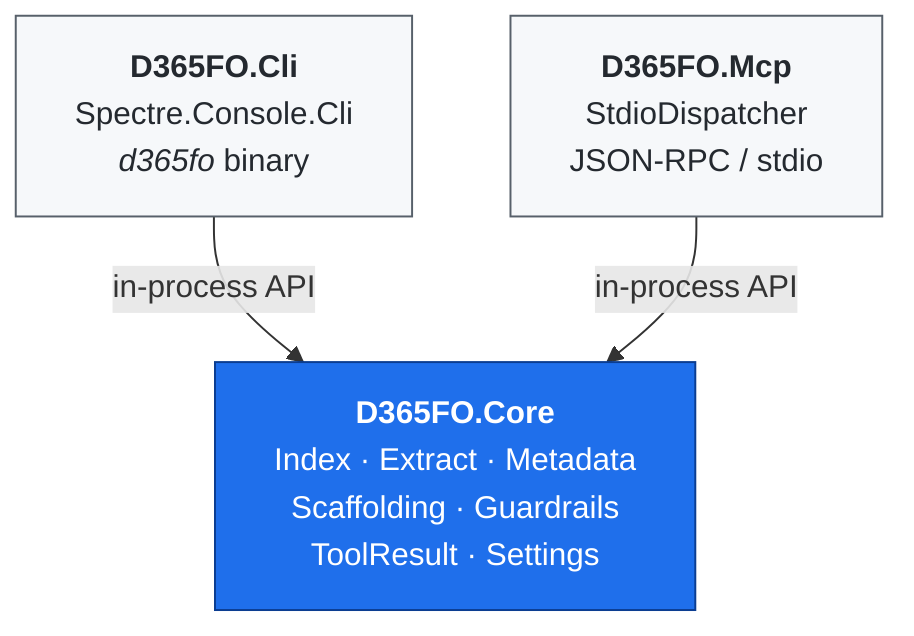

# Architecture

> For day-to-day usage see [SETUP.md](SETUP.md) and [EXAMPLES.md](EXAMPLES.md).

---

## High-level layout

Three projects, one shared core:



**Key invariant:** only `D365FO.Core` knows about D365FO. Both adapters are thin — each command is "parse args → call Core → render envelope".

---

## Output contract

Every command returns the same shape:

```json
{ "ok": true,  "data": { /* ... */ }, "warnings": [] }
{ "ok": false, "error": { "code": "UPPER_SNAKE", "message": "...", "hint": "..." } }
```

JSON on non-TTY stdout, rich tables on a terminal. Override with `--output json|table|raw`. Exit codes: `0` success · `1` controlled failure · `2` unhandled exception.

## Local index (SQLite)

Single file at `$D365FO_INDEX_DB` (default `%LOCALAPPDATA%\d365fo-cli\d365fo-index.sqlite`). Schema defined in [`src/D365FO.Core/Index/Schema.sql`](../src/D365FO.Core/Index/Schema.sql), version tracked via `PRAGMA user_version`; auto-migrated on first connection.

**Covered AOT types:** tables, classes, EDTs, enums, forms (+ extensions), menu items, labels, queries, views, data entities, reports, services, service groups, workflow types, security roles/duties/privileges + flattened `SecurityMap`, object extensions, event subscribers, CoC extensions, model dependencies.

**Extraction:** walks `<root>/<Package>/<Model>/`, parallelises per-file XML parsing inside each model. `*FormAdaptor` packages skipped. Idempotent per model — re-extract replaces that model's rows only.

**Guardrails:** `StringSanitizer` strips control characters from free-form metadata (labels, descriptions) to defend against prompt-injection embedded in customer data. Pass `--raw-text` to opt out. Write operations use atomic swap (`.tmp` + move) with `.bak` kept on overwrite.

## Metadata Bridge

`D365FO.Bridge` is a .NET Framework 4.8 child process that loads D365FO's own `IMetadataProvider`. The CLI spawns it on demand over stdio JSON-RPC. Activate with `D365FO_BRIDGE_ENABLED=1`.

| Variable | Purpose |
|---|---|
| `D365FO_PACKAGES_PATH` | Live `PackagesLocalDirectory` |
| `D365FO_BIN_PATH` | D365FO binaries directory (resolves metadata assemblies) |
| `D365FO_BRIDGE_ENABLED` | `1`/`true` enables bridge-primary reads |
| `D365FO_BRIDGE_PATH` | Override bridge exe location |

Provides: authoritative per-object reads (`get` commands), file create/update/delete (`generate --install-to`), cross-reference queries against `DYNAMICSXREFDB` (`find refs --xref`), model folder resolution. Non-Windows environments fall back to the SQLite index automatically. `get` responses carry `_source: "bridge"` / `"index"` so callers can audit which store answered.

## MCP coexistence

`D365FO.Mcp` forwards to the same `D365FO.Core` primitives as the CLI. It speaks the `ModelContextProtocol` C# SDK over stdio and exposes ~55 tools. Index, bridge, and guardrails are shared — both adapters see identical data.

Adding a new tool: one entry in `ToolCatalog` + one method on `ToolHandlers`. The CLI picks it up once a command wraps the same `MetadataRepository` call.

**Daemon mode** (`d365fo daemon start`) keeps the SQLite handle and read caches hot. Also starts a `FileSystemWatcher` that auto-triggers incremental `index refresh` when `*.xml` files change (debounce 3 s; disable with `--no-watch`).


---

## See also

- [SETUP.md](SETUP.md) / [EXAMPLES.md](EXAMPLES.md) — day-to-day usage.
- [TOKEN_ECONOMICS.md](TOKEN_ECONOMICS.md) — why CLI + Skills is cheaper per turn than MCP.
- [MIGRATION_FROM_MCP.md](MIGRATION_FROM_MCP.md) — coming from `d365fo-mcp-server`.
