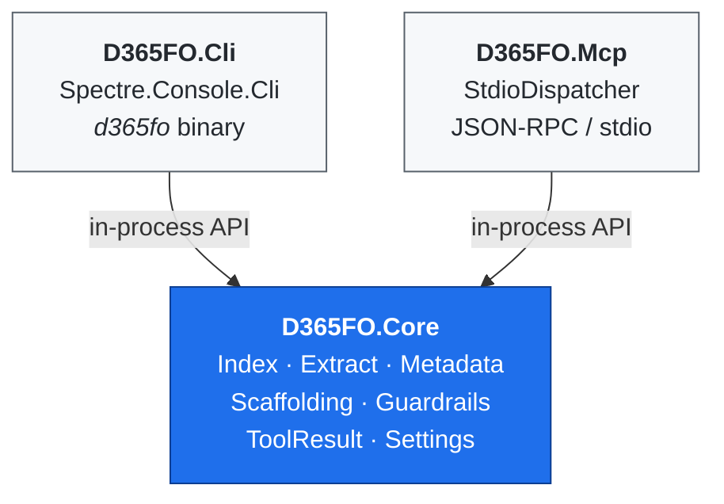

# Architecture

> For day-to-day usage see [SETUP.md](SETUP.md) and [EXAMPLES.md](EXAMPLES.md).

---

## High-level layout

Three projects, one shared core:



**Key invariant:** only `D365FO.Core` knows about D365FO. Both adapters are thin — each command is "parse args → call Core → render envelope".

---

## Output contract

Every command returns the same shape:

```json
{ "ok": true,  "data": { /* ... */ }, "warnings": [] }
{ "ok": false, "error": { "code": "UPPER_SNAKE", "message": "...", "hint": "..." } }
```

JSON on non-TTY stdout, rich tables on a terminal. Override with `--output json|table|raw`. Exit codes: `0` success · `1` controlled failure · `2` unhandled exception.

## Local index (SQLite)

Single file at `$D365FO_INDEX_DB` (default `%LOCALAPPDATA%\d365fo-cli\d365fo-index.sqlite`). Schema defined in [`src/D365FO.Core/Index/Schema.sql`](../src/D365FO.Core/Index/Schema.sql), auto-migrated on first connection.

### AOT object type coverage

| AOT Type | Directory | Notes |
|----------|-----------|-------|
| Table | `AxTable` | Fields, indexes, relations, delete actions, CacheLookup, OCC, ValidTimeState |
| Class | `AxClass` | Methods, CoC extensions, event handlers, lint flags |
| EDT | `AxEdt` | BaseType, extends, ReferenceTable, FormHelp, AnalysisUsage |
| Enum | `AxEnum` | Values, IsExtensible |
| Form | `AxForm` | Pattern, datasources, controls, extensions, Style, TitleDataSource |
| MenuItem | `AxMenuItemDisplay`, `AxMenuItemAction`, `AxMenuItemOutput` | Kind, object reference |
| Query | `AxQuery` | Root datasource, joins |
| View | `AxView` | Datasources, fields |
| DataEntity | `AxDataEntityView` | PublicEntityName, OData surface |
| Report | `AxReport` | Datasets, design |
| Service | `AxService` | Operations |
| ServiceGroup | `AxServiceGroup` | Service references |
| WorkflowType | `AxWorkflow` | Document class, elements |
| Map | `AxMap` | Fields, mapped tables |
| SecurityRole | `AxSecurityRole` | Duties, privileges |
| SecurityDuty | `AxSecurityDuty` | Privileges |
| SecurityPrivilege | `AxSecurityPrivilege` | Entry points |
| SecurityPolicy | `AxSecurityPolicy` | ConstrainedTable, PolicyQuery, OperationType, ContextType |
| ConfigurationKey | `AxConfigurationKey` | ParentKey, LicenseCode, IsEnabled |
| BusinessEvent | detected in `AxClass` | Category, ContractClass, `[BusinessEvents(...)]` attribute |
| Tile | `AxTile` | MenuItemName, TileType |
| Workspace | `AxWorkspace` | Layout descriptor (not AxForm) |

**Extraction:** walks `<root>/<Package>/<Model>/`, parallelises per-file XML parsing inside each model. `*FormAdaptor` packages skipped. Idempotent per model — re-extract replaces that model's rows only.

**Guardrails:** `StringSanitizer` strips control characters from free-form metadata (labels, descriptions) to defend against prompt-injection embedded in customer data. Pass `--raw-text` to opt out. Write operations use atomic swap (`.tmp` + move) with `.bak` kept on overwrite.

---

## Business Events indexing

Business events in D365FO are implemented as X++ classes extending `BusinessEventsBase` — there is no separate `AxBusinessEvent` directory in the AOT. The extractor detects them during the `AxClass` walk by:

1. Scanning class declaration source for `extends BusinessEventsBase`.
2. Extracting the `[BusinessEvents(classStr(EventClass), classStr(ContractClass), "Category", "Description")]` attribute arguments.
3. Storing `Name`, `Category`, `ContractClass`, `ModelId`, `SourcePath` in the `BusinessEvents` schema table.

Commands:
- `d365fo search business-event <query>` — search by name or category
- `d365fo get business-event <name>` — show contract class and attributes

---

## Security Policy (XDS) indexing

Extensible Data Security (XDS) policies restrict which rows a user can read or write based on the user's security context. They live in `AxSecurityPolicy` directories and are indexed with:

- `Name`, `ConstrainedTable`, `PolicyQuery`, `OperationType` (All / Select / Insert / Update / Delete)
- `ContextType` (ContextString / RoleName), `ContextValue`
- `IsEnabled`, `IsMandatory`, `ModelId`

Commands:
- `d365fo search security-policy <query>` — find policies by name or constrained table
- `d365fo get security-policy <name>` — inspect full policy metadata
- `d365fo generate security-policy <name>` — scaffold a new XDS policy

---

## Lint rule categories (16 rules)

`d365fo lint` runs in-process heuristics against the SQLite index. Rules are evaluated without touching the VM.

| Category | What it finds | Severity |
|----------|--------------|---------|
| `table-no-index` | Tables without cluster or alternate-key index | warning |
| `ext-named-not-attributed` | `*_Extension` classes missing `[ExtensionOf]` | warning |
| `string-without-edt` | String fields without an EDT | warning |
| `today-usage` | `today()` calls (`BPUpgradeCodeToday`) | warning |
| `do-insert-update` | `doInsert()` / `doUpdate()` / `doDelete()` calls in non-migration code | warning |
| `doc-comment-missing` | Public/protected methods without `/// <summary>` | warning |
| `nested-select` | `while select` nested inside another loop (`BPCheckNestedLoopInCode`) | warning |
| `insert-in-loop` | `.insert()` call inside a loop body — suggest `RecordInsertList` (`BPCheckInsertMethodInLoop`) | warning |
| `tts-try-catch` | `try` block inside `ttsbegin`/`ttscommit` without catching `UpdateConflict` (`BPCheckNoTTSTryBlock`) | warning |
| `empty-table-method` | Table method override with empty body — forces row-by-row DB ops (`BPCheckEmptyTableMethod`) | warning |
| `runbase-no-can-go-batch` | `RunBaseBatch` subclass without `canGoBatch() { return true; }` (`BPCheckBatchJobsEnabled`) | warning |
| `force-literals` | `forceLiterals` in a select — SQL injection risk | error |
| `cache-lookup-mismatch` | `CacheLookup` value inconsistent with `TableGroup` (`BPCheckTablePropertyMismatch`) | warning |
| `missing-delete-action` | Table relations without `DeleteAction` or `OnDelete` configured (`BPCheckMissingDeleteActions`) | warning |
| `no-alternate-key` | Tables with unique indexes but no `AlternateKey = Yes` index (`BPCheckAlternateKeyAbsent`) | warning |
| `unknown-label-ref` | Label `@File:Key` references in source that don't resolve in the `Labels` table (`BPErrorUnknownLabel`) | error |

Use `--category <name>[,<name>…]` to run specific rules. `--format sarif` emits SARIF 2.1.0 for CI.

---

## Form pattern engine

`D365FO.Core.FormPatterns` ports the MCP server's form pattern engine: a
data-driven catalog of Microsoft form patterns plus a pure structural validator.

**Catalog** (`FormPatternCatalog`): 18 top-level patterns (SimpleList,
SimpleListDetails, DetailsMaster ±Tabs, DetailsTransaction, Dialog, DropDialog,
TableOfContents, Lookup, ListPage, Workspace ±Operational, Form Part / FactBox
variants, Simple Details, legacy Task patterns, Wizard) and 19 container
sub-patterns (FieldsFieldGroups, CustomAndQuickFilters, SidePanel,
ToolbarAndList, workspace sections, …). Each spec encodes what the Visual
Studio pattern engine enforces — required containers, ordering, allowed child
control types, applicable sub-patterns, expected properties, known
`PatternVersion`s — as data, sourced from Microsoft Learn guideline docs and
reference forms.

**Validator** (`FormPatternValidator`, rules FP001–FP010):

| Rule | Severity | What it finds |
|---|---|---|
| `FP001` | error | Unknown `<Pattern>` on Design / unknown sub-pattern on a container |
| `FP002` | error / warning | Unknown `PatternVersion` (error); older or newer-than-catalog version (warning) |
| `FP003` | error | Required node missing (e.g. SimpleList without a Grid) |
| `FP004` | error | Child control type not allowed in a patterned container |
| `FP005` | error | Required children out of order (e.g. Grid before ActionPane) |
| `FP006` | warning | Container that requires a sub-pattern has none ("unspecified") |
| `FP007` | error | Sub-pattern applied to an unsupported control type / parent pattern |
| `FP008` | warning | Datasource expectation unmet (count / header+lines) |
| `FP009` | warning | Design/control property differs from the pattern default |
| `FP010` | warning | No `<Pattern>` declared on Design at all |

Only structural rules (FP001–FP005, FP007) are errors and may block writes;
the rest are recommendations. The `Design` walker is namespace-agnostic
(AxForm XML mixes the `Microsoft.Dynamics.AX.Metadata.V6` default namespace
with `xmlns=""` resets) and resolves extension controls (QuickFilter) via
`FormControlExtension/Name`.

**Write gate:** `generate form` (CLI and MCP adapter) self-tests the generated
XML and fails with `FORM_PATTERN_VIOLATION` on structural errors while
`D365FO_FORM_PATTERN_ENFORCE=true` (default). A golden-gate test asserts every
template the scaffolder emits passes its declared pattern. Surface commands:
`get form-pattern` (spec catalog), `validate form-pattern` (file/stdin,
exit 2 on errors).

---

## Metadata Bridge

`D365FO.Bridge` is a .NET Framework 4.8 child process that loads D365FO's own `IMetadataProvider`. The CLI spawns it on demand over stdio JSON-RPC. Activate with `D365FO_BRIDGE_ENABLED=1`.

| Variable | Purpose |
|---|---|
| `D365FO_PACKAGES_PATH` | Primary `PackagesLocalDirectory` root |
| `D365FO_CUSTOM_PACKAGES_PATH` | Additional roots (semicolon/comma-separated). Used for UDE dual-folder setups — see [SETUP.md](SETUP.md#ude-unified-developer-experience-setup). |
| `D365FO_BIN_PATH` | D365FO binaries directory (resolves metadata assemblies) |
| `D365FO_BRIDGE_ENABLED` | `1`/`true` enables bridge-primary reads |
| `D365FO_BRIDGE_PATH` | Override bridge exe location |

Provides: authoritative per-object reads (`get` commands), file create/update/delete (`generate --install-to`), cross-reference queries against `DYNAMICSXREFDB` (`find refs --xref`), model folder resolution. Non-Windows environments fall back to the SQLite index automatically. `get` responses carry `_source: "bridge"` / `"index"` so callers can audit which store answered.

## MCP coexistence

`D365FO.Mcp` forwards to the same `D365FO.Core` primitives as the CLI. It speaks the `ModelContextProtocol` C# SDK over stdio and exposes ~55 tools. Index, bridge, and guardrails are shared — both adapters see identical data.

Adding a new tool: one entry in `ToolCatalog` + one method on `ToolHandlers`. The CLI picks it up once a command wraps the same `MetadataRepository` call.

**Daemon mode** (`d365fo daemon start`) keeps the SQLite handle and read caches hot. Also starts a `FileSystemWatcher` that auto-triggers incremental `index refresh` when `*.xml` files change (debounce 3 s; disable with `--no-watch`).

---

## See also

- [SETUP.md](SETUP.md) / [EXAMPLES.md](EXAMPLES.md) — day-to-day usage.
- [TROUBLESHOOTING.md](TROUBLESHOOTING.md) — common failure modes and fixes.
- [TOKEN_ECONOMICS.md](TOKEN_ECONOMICS.md) — why CLI + Skills is cheaper per turn than MCP.
- [MIGRATION_FROM_MCP.md](MIGRATION_FROM_MCP.md) — coming from `d365fo-mcp-server`.
