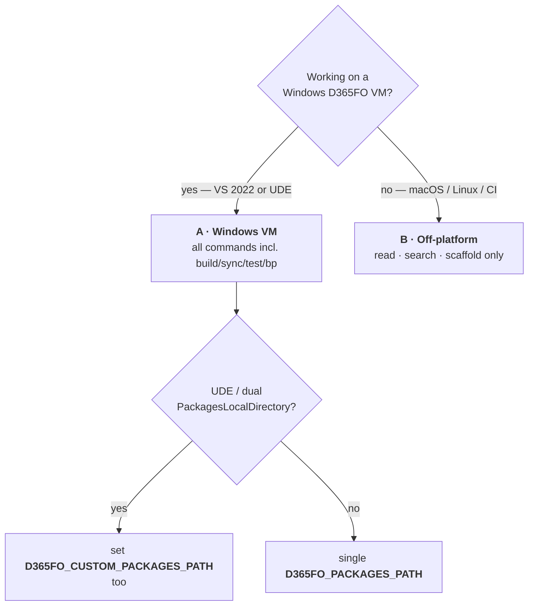
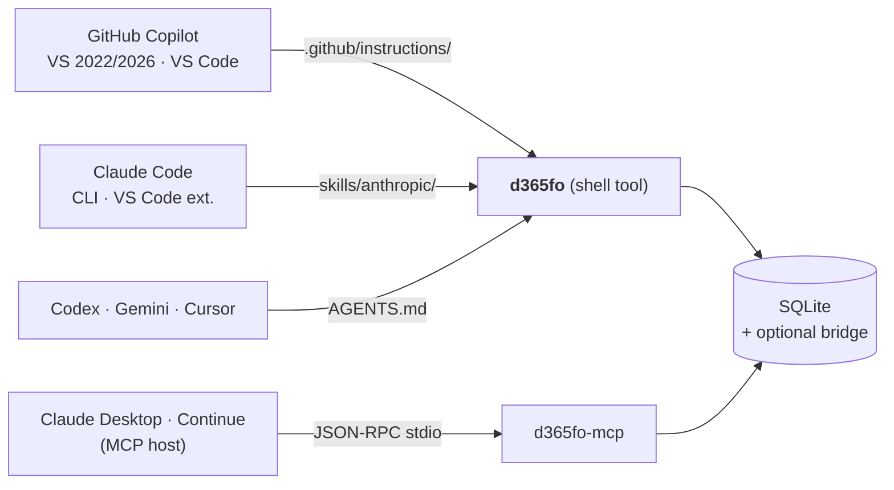

# Setup

Five steps from a fresh clone to a working index that any AI agent can query.

> **TL;DR** — install .NET 10 · build the CLI · `d365fo init --persist-profile` · `d365fo index extract` · point your AI agent at it. Done.
> Day-to-day commands: [EXAMPLES.md](EXAMPLES.md) · env vars: [CONFIGURATION.md](CONFIGURATION.md) · architecture: [ARCHITECTURE.md](ARCHITECTURE.md).

---

## Choosing your install path



| Scenario | Index | Read / search / scaffold | `build` / `sync` / `test` / `bp` | Bridge writes |
|---|:---:|:---:|:---:|:---:|
| **A** · Windows D365FO VM | ✅ local SQLite | ✅ | ✅ | ✅ |
| **A-UDE** · UDE dual roots | ✅ local SQLite | ✅ | ✅ | ✅ |
| **B** · Off-platform (mac/Linux/CI) | ✅ local SQLite (extracted from a network share or imported) | ✅ | ❌ `UNSUPPORTED_PLATFORM` | ❌ |

---

## Step 1 — Prerequisites

| Component | Version | Needed for |
|---|---|---|
| .NET SDK | **10** (pinned in `global.json`) | building / running the CLI |
| `git` | any | `d365fo review diff` |
| Visual Studio 2022 / 2026 + Dynamics 365 F&O workload | latest | scenario A — `MSBuild.exe`, `SyncEngine.exe`, `SysTestRunner.exe`, `xppbp.exe` on `PATH` |
| GitHub Copilot extension | latest | VS agent mode (optional) |
| .NET Framework 4.8 Developer Pack | 4.8 | bridge (`D365FO_BRIDGE_ENABLED=1`) — pre-installed on D365FO VMs |

> Off-platform setups (B) only need .NET 10 + git. Everything else is gated by `UNSUPPORTED_PLATFORM` and never invoked.

---

## Step 2 — Install

### Option 1 — Dev mode (alias, fastest)

```sh
git clone https://github.com/dynamics365ninja/d365fo-cli.git
cd d365fo-cli
dotnet build d365fo-cli.slnx -c Release
```

Alias once, never rebuild manually again:

```sh
# bash / zsh — ~/.zshrc or ~/.bashrc
alias d365fo='dotnet run --project /path/to/d365fo-cli/src/D365FO.Cli --'
```

```powershell
# PowerShell — $PROFILE
function d365fo { dotnet run --project C:\path\to\d365fo-cli\src\D365FO.Cli -- @args }
```

### Option 2 — Self-contained binary (CI, shared VMs)

```sh
# Windows
dotnet publish src/D365FO.Cli -c Release -r win-x64 --self-contained `
  -p:PublishSingleFile=true -p:PublishTrimmed=true

# macOS / Linux
dotnet publish src/D365FO.Cli -c Release -r osx-arm64 --self-contained \
  -p:PublishSingleFile=true -p:PublishTrimmed=true
```

Supported RIDs: `win-x64`, `linux-x64`, `osx-x64`, `osx-arm64`. Output lands in `src/D365FO.Cli/bin/Release/net10.0/<rid>/publish/`. Rename to `d365fo` (`d365fo.exe` on Windows) and put it on `PATH`. Drop `--self-contained` if .NET 10 is already installed — output shrinks from ~70 MB to a few MB.

---

## Step 3 — Configure (one command)

```powershell
d365fo init --packages K:\AosService\PackagesLocalDirectory --persist-profile
```

`init` writes both the JSON config (`%LOCALAPPDATA%\d365fo-cli\settings.json`) **and** every `$PROFILE` it finds (Windows PowerShell 5.1, PowerShell 7, VS Developer PowerShell). Subsequent shells inherit the settings automatically; you never have to remember which `$PROFILE` you edited.

**UDE / dual packages roots:**

```powershell
d365fo init `
  --packages       K:\AosService\PackagesLocalDirectory `
  --extra-packages C:\LocalMetadata\PackagesLocalDirectory `
  --persist-profile
```

`--extra-packages` is repeatable. Missing extra roots are silently skipped (the primary root still errors if absent). Multiple extra roots can also be supplied as one semicolon-separated `D365FO_CUSTOM_PACKAGES_PATH` value.

> **Manual override** — bypass `init` and set env vars yourself if you prefer. The minimum is `D365FO_PACKAGES_PATH`; see [CONFIGURATION.md](CONFIGURATION.md) for the full list. Env vars always win over the JSON config.

### Visual Studio Developer PowerShell pitfall

VS Developer PowerShell is **Windows PowerShell 5.1** (`powershell.exe`), which reads a different `$PROFILE` than PowerShell 7 (`pwsh.exe`):

| Shell host | Profile path |
|---|---|
| Windows PowerShell 5.1 / VS Developer PowerShell | `%USERPROFILE%\Documents\WindowsPowerShell\Microsoft.PowerShell_profile.ps1` |
| PowerShell 7+ (`pwsh`) | `%USERPROFILE%\Documents\PowerShell\Microsoft.PowerShell_profile.ps1` |

`d365fo init --persist-profile` writes to **both** profile files plus the JSON config, so the same settings apply everywhere. If you still see disagreements between hosts, the JSON config is authoritative.

---

## Step 4 — Build the index

```sh
d365fo index build      # create / migrate the SQLite schema
d365fo index extract    # ingest metadata from PACKAGES_PATH (idempotent)
d365fo doctor           # confirm everything is green
```

`index extract` is idempotent (re-runs replace rows per model). Scope it to save time:

```sh
d365fo index extract --model MyCustomModel       # seconds
d365fo index extract --model ApplicationSuite    # minutes — parallelised per file
```

| When to refresh | Command |
|---|---|
| You edited XML in a custom model | `d365fo index refresh --model <Model>` |
| New PU / hotfix metadata landed | `d365fo index extract` (re-runs only changed models) |
| `git pull` brought a new schema | `d365fo index build` (in-place migration) |
| Results look stale or wrong | `d365fo doctor` → `d365fo index status` |

Or run the daemon and forget about it — `d365fo daemon start` keeps the SQLite handle hot and auto-refreshes on `*.xml` changes (3 s debounce, disable with `--no-watch`).

---

## Step 5 — Connect your AI agent



### GitHub Copilot — Visual Studio 2022 / 2026 / VS Code (agent mode)

1. Place `d365fo` on `PATH` (either Option 1 alias or Option 2 binary above).
2. Deploy the Skills into a parent folder of your X++ solutions:

   ```powershell
   .\scripts\Install-D365FoCopilotSkills.ps1 `
     -CliRepo C:\source\d365fo-cli `
     -XppRepo K:\D365FO\MyProject
   ```

   The script copies `.github/copilot-instructions.md` and all `skills/copilot/*.instructions.md` files. One copy in a common parent covers every solution beneath it — VS searches upward from the `.sln`.
3. **Agent mode (recommended).** Open Copilot Chat → mode dropdown (top-right) → **Agent**. Copilot now calls `d365fo` directly via its terminal tool — no copy-paste.
4. **Chat mode (fallback).** Without agent tools, Copilot asks you to run `d365fo` commands in Developer PowerShell and paste the JSON back. The Skills teach Copilot to ask first — if it skips that step the `.github/copilot-instructions.md` file is missing from the parent folder.

> ⚠️ **Never** use `@workspace` or built-in code search on AOT XML. It always fails. Copilot must use `d365fo` exclusively for codebase queries; the Skills enforce this.

### Claude Code (CLI or VS Code extension)

```sh
python3 scripts/emit-skills.py                            # emits skills/anthropic/*/SKILL.md
cp -r skills/anthropic /your-repo/.claude/skills
```

Anthropic SKILL.md files load on demand — Claude reads the YAML frontmatter first and only pulls the full instruction when relevant.

### Codex · Gemini · Cursor · any agent with a shell

Reference the `skills/anthropic/*/SKILL.md` files from your session prompt or `AGENTS.md`. The body of each skill teaches the agent which `d365fo` commands to run for that task.

### MCP hosts (Claude Desktop, Continue, VS Code MCP)

```json
{
  "mcpServers": {
    "d365fo": {
      "command": "d365fo-mcp",
      "args": [],
      "env": { "D365FO_PACKAGES_PATH": "K:\\AosService\\PackagesLocalDirectory" }
    }
  }
}
```

`d365fo-mcp` is the bundled JSON-RPC 2.0 adapter that exposes 20 consolidated, discriminator-based tools backed by the same SQLite index and bridge. Useful for hosts without a shell tool — see [ARCHITECTURE.md#mcp-coexistence](ARCHITECTURE.md#mcp-coexistence).

### Verify

Open the AI chat and ask:

```
What tables contain "CustAccount" field?
```

A `d365fo search` call returning results from your codebase = you are connected.

---

## Quickstart scripts

Copy-paste to go from a fresh clone to a working index in one shot.

### PowerShell (Windows D365FO VM)

```powershell
# Edit the first three lines, then run the rest as-is.
$Repo  = "C:\source\d365fo-cli"
$Pkg   = "K:\AosService\PackagesLocalDirectory"
$Langs = "en-us"          # add languages you actually use, e.g. "en-us,cs,de"

# 1. Build
Push-Location $Repo
dotnet build d365fo-cli.slnx -c Release
Pop-Location

# 2. Alias + env + JSON config in one shot
Add-Content -Path $PROFILE -Value "function d365fo { dotnet run --project $Repo\src\D365FO.Cli -- @args }"
Add-Content -Path $PROFILE -Value "`$env:D365FO_LABEL_LANGUAGES = '$Langs'"
. $PROFILE
d365fo init --packages $Pkg --persist-profile

# 3. Populate the index
d365fo index build
d365fo index extract
d365fo doctor
```

### bash / zsh (macOS / Linux)

```sh
REPO=$HOME/source/d365fo-cli
PKG=/mnt/d365fo/PackagesLocalDirectory
LANGS="en-us"

cd "$REPO" && dotnet build d365fo-cli.slnx -c Release

{
  echo ""
  echo "# d365fo-cli"
  echo "alias d365fo='dotnet run --project $REPO/src/D365FO.Cli --'"
  echo "export D365FO_LABEL_LANGUAGES=\"$LANGS\""
} >> "$HOME/.zshrc"
source "$HOME/.zshrc"

d365fo init --packages "$PKG" --persist-profile
d365fo index build
d365fo index extract
d365fo doctor
```

---

## Troubleshooting

| Symptom | Fix |
|---|---|
| `PACKAGES_PATH_NOT_FOUND` | `d365fo init --packages <PATH> --persist-profile`, or set `D365FO_PACKAGES_PATH` manually |
| `UNSUPPORTED_PLATFORM` | `build` / `sync` / `test` / `bp` require Windows + a D365FO dev VM. Everything else still works |
| `NO_INDEX` | `d365fo index build && d365fo index extract` |
| `stale-index` warning from `doctor` | `d365fo index refresh --model <Model>` (or just start the daemon) |
| Copilot Chat says "There was an error executing code search" then writes generic X++ | VS Copilot Chat cannot search AOT XML — `.github/copilot-instructions.md` must be deployed in a parent folder. Re-run `Install-D365FoCopilotSkills.ps1` and restart VS. For full automation switch Copilot Chat to **Agent** mode |
| Index file appears locked | Stop any running `d365fo daemon` or `d365fo-mcp` process; `-wal` / `-shm` sidecar files are normal |
| Settings differ between Developer PowerShell and PowerShell 7 | Re-run `d365fo init --persist-profile` — it writes both profiles and the JSON config |
| Self-contained binary won't start on Linux | `chmod +x d365fo` after copying out of the publish folder |
| Label values contain control characters | `search label` / `get label` strip them by default — pass `--raw-text` for the unfiltered value |

Full failure-mode catalogue: [TROUBLESHOOTING.md](TROUBLESHOOTING.md).

---

## What's next

| Topic | Documentation |
|---|---|
| One worked example per command | [EXAMPLES.md](EXAMPLES.md) |
| Every env var and config option | [CONFIGURATION.md](CONFIGURATION.md) |
| Index schema, guardrails, bridge, daemon | [ARCHITECTURE.md](ARCHITECTURE.md) |
| Why CLI + Skills beats MCP on token cost | [TOKEN_ECONOMICS.md](TOKEN_ECONOMICS.md) |
| Moving off `d365fo-mcp-server` | [MIGRATION_FROM_MCP.md](MIGRATION_FROM_MCP.md) |
| Tool decision matrix (when to use `d365fo` vs built-in editor tools) | [CAPABILITIES.md](CAPABILITIES.md) |
