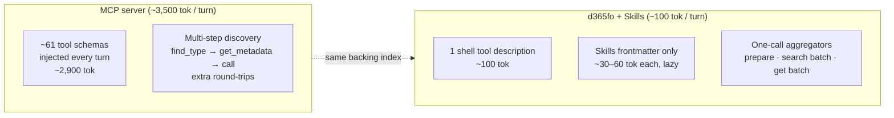

# Token Economics

> **TL;DR** — CLI + Skills costs **~100 tokens per turn**. The equivalent MCP server costs **~3,500 tokens per turn**. Over a real 15-turn task that's ~90 % off the agent's context bill, before any savings from collapsing multi-step discovery flows.

---

## Where the tokens go

Every MCP request loads all tool schemas into the model context — there is no "load on demand". The CLI exposes one shell tool; the agent discovers commands via `d365fo schema` only when it needs them. Skills add ~30–60 tokens of frontmatter per `.instructions.md` file; the full skill body is only paged in when the agent decides it is relevant.

---

## Expected savings

| Turns | MCP overhead | CLI + Skills overhead | Saving |
|---:|---:|---:|---:|
|  5 | ~14,500 |  ~2,800 | **~81 %** |
| 10 | ~29,000 |  ~3,500 | **~88 %** |
| 15 | ~44,000 |  ~4,000 | **~91 %** |
| 20 | ~58,000 |  ~4,500 | **~92 %** |

Real workflows save more — MCP also pays for discovery round-trips (often 5–15 kT per workflow) that the CLI eliminates with single-call aggregators like `d365fo prepare change`, `d365fo get batch table:CustTable class:CustTableType edt:CustAccount`, or `d365fo search batch <q1> <q2> <q3>`.

---

## When CLI does **not** save

| Situation | Recommended |
|---|---|
| AI host without a shell tool (Claude.ai web, ChatGPT web) | MCP — the bundled `d365fo-mcp` adapter speaks JSON-RPC over the same index |
| Single one-off lookup per session | Either — an MCP warm connection has no per-turn startup cost |
| Agent needs the full generated XML back in context | Avoid both — `d365fo generate` always writes to `--out` and returns a JSON summary only |

---

## Sources

- Anthropic — [Equipping agents for the real world with Agent Skills](https://www.anthropic.com/engineering/equipping-agents-for-the-real-world-with-agent-skills), October 2025.
- Simon Willison — [Claude Skills are awesome, maybe a bigger deal than MCP](https://simonwillison.net/2025/Oct/16/claude-skills/), October 2025.
- seangalliher — [D365-erp-cli, "Why CLI over MCP?"](https://github.com/seangalliher/D365-erp-cli#why-cli-over-mcp).

---

## See also

- [EXAMPLES.md](EXAMPLES.md#agent-integration) — wiring Skills and the CLI into each AI agent.
- [ARCHITECTURE.md](ARCHITECTURE.md) — the Metadata Bridge and where `d365fo-mcp` plugs in.
- [MIGRATION_FROM_MCP.md](MIGRATION_FROM_MCP.md) — decision tree for MCP users.
